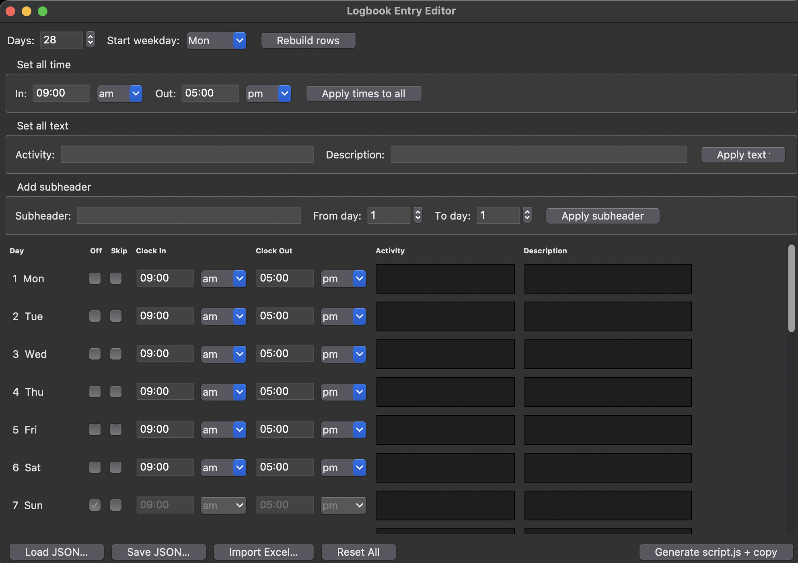

# [AFX] Logbook Entry Editor

A desktop tool to fill out the Binus campus logbook fast. Builds entries once in a simple table, 
then generate a script that auto-fills the whole month on the logbook site in one paste.



## Requirements

- Python 3.x (tkinter ships with it — no extra install needed to run the UI)
- `openpyxl` — only needed for **Import Excel…**: `pip install -r requirements.txt`

**No GUI window / blank screen?** Check tkinter present: `python3 -c "import tkinter"`.
Error means Tk missing from your Python build, not app bug. Fix per OS:
- **macOS**: python.org/pyenv builds often lack Tcl/Tk. Use system Python3, or
  `brew install python-tk` (or `brew install tcl-tk` then rebuild via pyenv).
- **Linux**: `sudo apt install python3-tk` (Debian/Ubuntu) or `sudo dnf install python3-tkinter` (Fedora).
- **Windows**: official python.org installer bundles Tk — reinstall from there if using
  Microsoft Store Python.
- **SSH/headless**: no `$DISPLAY` — GUI needs a real desktop session, not remote shell.

**Still no luck?** Use the web fallback instead — no Python/Tk needed at all:
open `web/logbook_editor.html` directly in your browser (double-click it, or
`open web/logbook_editor.html`). Same features, including Excel import. Keep
`web/vendor/xlsx.full.min.js` next to it.

## How to use it

1. **Run it**: `python logbook_ui.py`
2. **Fill the table**: set Days/Start weekday, then per row set Clock In/Out,
   Activity, Description. Mark **Off** for days off, or **Skip** to leave a
   day untouched. Sundays are auto-locked as Off (no button on the site).
3. **Fill it faster**:
   - **Set all time** / **Set all text** — apply one value to every row at once.
   - **Add subheader** — prepend a tag like `(XXXXX Project)` to Activity
     for a From day–To day range, e.g. turns `Ticket AX-122` into
     `(XXXXX Project) Ticket AX-122`.
   - **Import Excel…** — load Activity/Description straight from your
     company's monthly timesheet `.xlsx` (Task → Activity, Detail →
     Description) instead of typing everything by hand. Days count, Start
     weekday, and Off days (rows with `0:00`/`0:00`) are detected automatically.
   - **Save/Load JSON…** — keep your entries to reuse or edit later.
4. **Generate**: click **Generate script.js + copy** — writes
   `script.generated.js` and copies it to your clipboard.
5. **Run it on the site**: open the logbook page, open DevTools console
   (`F12`), type `allow pasting` if prompted, paste, and hit Enter.

## Notes

- Row order in the UI must match the page's day order top to bottom.
- The script matches `.detailsbtn` buttons in page order to your rows —
  filling an already-filled day just overwrites it.
- Assumes one button per day; if a filled day has no button, indexes shift —
  Skip that row or adjust the day count.

## Build a standalone executable

No Python needed to run the built binary:

```bash
pip install pyinstaller openpyxl
pyinstaller --onefile logbook_ui.py
```

Binary lands in `dist/` (e.g. `dist/logbook_ui.exe` on Windows). `build/`,
`dist/`, and `*.spec` are build artifacts — safe to delete.
